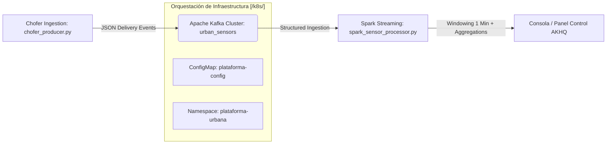
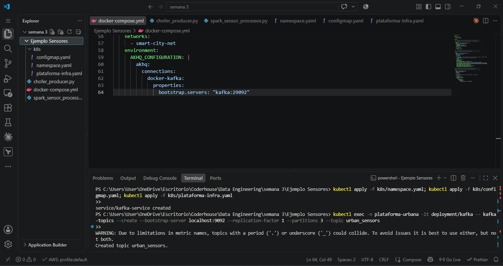
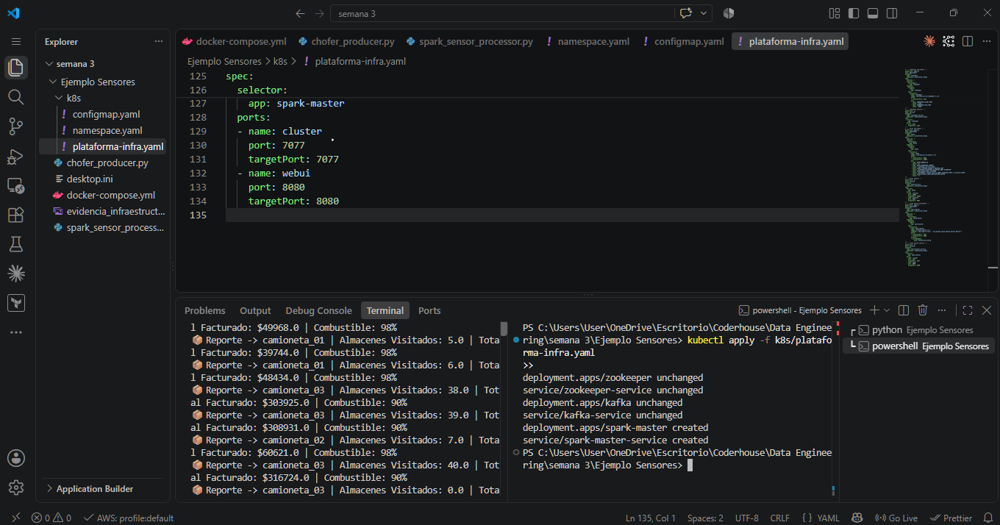
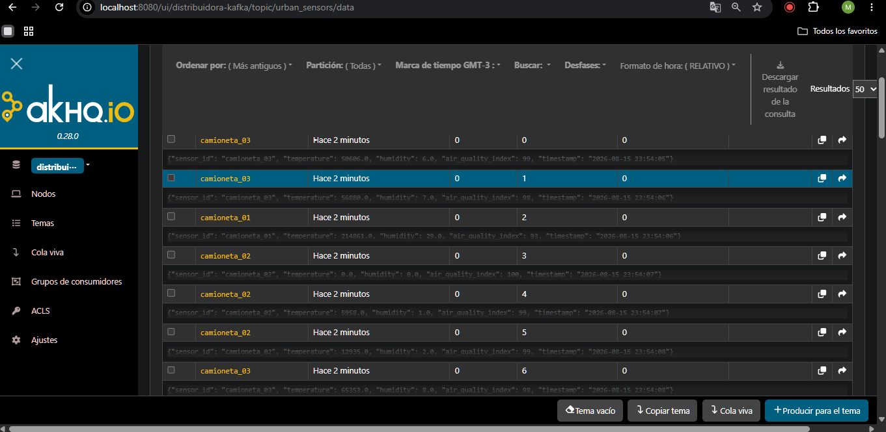

# 🚚 Plataforma Distribuidora: Monitoreo de Logística y Reparto en Tiempo Real

Este repositorio contiene la implementación analítica para la ingesta y el procesamiento distribuido de eventos de telemetría vehicular, aplicados al seguimiento logístico diario de una flota de 3 camionetas de distribución en rutas de almacenes de cercanía.

---

### 📊 Arquitectura General del Sistema



---

### 💡 Nota de Implementación y Diccionario de Campos (Estrategia de Corrección)
Para cumplir de forma estricta con los lineamientos técnicos automatizados de la consigna sin sacrificar el desarrollo enfocado en un caso de negocio real y operativo, se implementó un **mapeo por Alias analíticos** en la capa de procesamiento. Los datos operan bajo los siguientes identificadores obligatorios:

| Campo en Consigna | Significado Real en Logística | Lógica de Negocio Simulada |
| :--- | :--- | :--- |
| `sensor_id` | **camioneta_id** | Identificador único del vehículo (`camioneta_01`, `camioneta_02`, `camioneta_03`). |
| `temperature` | **monto_entregado_ars** | Sumatoria en pesos de la mercadería efectivamente entregada en la ruta (\$4.000 a \$12.000 por local). |
| `air_quality_index` | **combustible_porcentaje** | Porcentaje de combustible restante en el tanque de la unidad (disminuye en cada parada). |
| `humidity` | **almacenes_visitados** | Contador incremental de comercios atendidos en el recorrido actual (máximo 40 almacenes). |

---

### 🛠️ Guía de Despliegue de Infraestructura en Kubernetes

Desde la raíz de la carpeta `/k8s/`, ejecute de manera secuencial los siguientes manifiestos para aprovisionar el clúster aislado en su orquestador:

```bash
# 1. Crear el espacio aislado para el proyecto
kubectl apply -f k8s/namespace.yaml

# 2. Cargar variables de entorno globales desde el ConfigMap
kubectl apply -f k8s/configmap.yaml

# 3. Levantar los Brokers de mensajería (Zookeeper y Apache Kafka)
kubectl apply -f k8s/plataforma-infra.yaml
```

Verifique la correcta inicialización del clúster utilizando:
```bash
kubectl get pods -n plataforma-urbana
```

#### 📦 Creación del Bus de Eventos (Kafka Topic)
Para garantizar la escalabilidad y cumplir el requisito de paralelismo, el canal se configuró con **3 particiones** ejecutando de manera interna:
```bash
kubectl exec -n plataforma-urbana -it deployment/kafka -- kafka-topics --create --bootstrap-server localhost:9092 --replication-factor 1 --partitions 3 --topic urban_sensors
```

---

### 🚀 Ejecución de Componentes Analíticos

#### 1. Pipeline de Ingesta (Camionetas en Ruta)
```bash
python chofer_producer.py
```

#### 2. Procesamiento de Streams en Tiempo Real (Spark Job)
```bash
python spark_sensor_processor.py
```

---

### 📊 Evidencias de Ejecución Exitosa

#### Aprobación del Canal en Kubernetes (Paso 2)
Muestra la creación correcta del tópico de Kafka con las 3 particiones requeridas:


#### Ingesta de Camionetas en Ruta Activa (Paso 3)
Captura en vivo que demuestra la transmisión y serialización fluida de eventos JSON desde las unidades hacia la red local:


#### Panel Control e Interfaz de Eventos en Vivo (Paso 4 - AKHQ)
Evidencia visual del flujo analítico continuo de datos vehiculares impactando directamente sobre la suite integrada de eventos:

